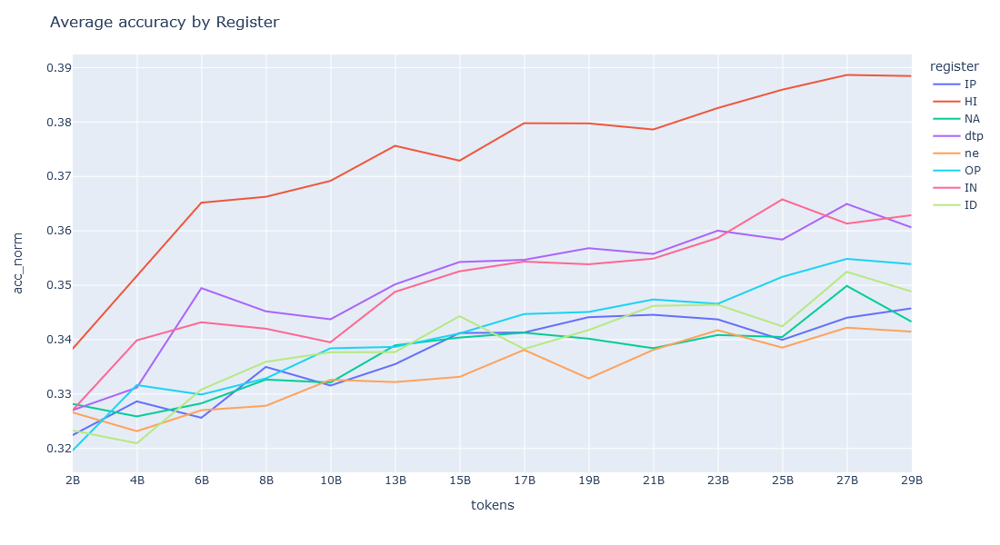

# register-model-training
Dump for training small llama-style models with register filtered data on LUMI. Idea is to evaluate the quality of different registers as LLM training data. The setup is copied from FineWeb. 




## Requirements

- ``gpt-neox``: Clone from [here](https://github.com/Vmjkom/gpt-neox) and use **revert** branch
- LUMI container with appropriate PyTorch installation, see [``README``](https://github.com/Vmjkom/gpt-neox?tab=readme-ov-file#module) on ``gpt-neox``
- ``lighteval``: ``pip install lighteval`` is adequate but ready made custom tasks can be found [here](https://github.com/JousiaPiha/Lighteval-on-LUMI/tree/main), specifically [here](https://github.com/JousiaPiha/Lighteval-on-LUMI/tree/main/evals/tasks)

## Get started

### ``sampling``

Once you have access to data in ``.jsonl`` format, and their labels, you can run ``run_sample.sh`` to get data in the format 

```
{"id": <id>, "text": <text>, "labels": <full classification label>}
```

For now, the labels and texts are assumed to be in separate files which are together piped to ``sample.py``. ``run_sample.sh`` takes in two params, the split numbers to iterate over, since out data is splitted for now.

``sample.py`` checks that prediction and text ids match, parses the label, and outputs the results to correct file for each register. 

### ``configs``

Contains a template that can be modified for any register simply by 

```sed "s/{{REGISTER}}/${REGISTER}/g" $path_to_TEMPLATE > $new_CONFIG```

 (as seen in ``training/train.py``). See [this](https://github.com/EleutherAI/gpt-neox/blob/main/configs/neox_arguments.md) for parameter explanations. In training, assumed location of configs is ``register-model-training/configs/{{REGISTER}}_1_82B_8N.yml``

### ``training/tokenize.sh``

Tokenize (unsharded) input file using GPT2Tokenizer. Requires the tokenizer as ``vocab.json`` and ``merges.txt`` files, easy to acquire from transformers if you don't have them, e.g. like [this](https://github.com/huggingface/tokenizers/issues/521). For sharded/splitted files, ``../gpt-neox/tools/datasets/merge_datasets.py`` can be used after tokenization. Modify params at the start of the file and run as ``sbatch tokenize.sh``. This should create two files, ``.bin`` and ``.idx``. Make sure that config points to these files.

### ``training/train.py``

Uses 8 nodes with 8 GPUs to train a model according to the given register's configuration. Run as ``sbatch train.sh {{REGISTER}}``, config created automatically from template if it does not exist in the assumed location. 12h of training is approximately equivalent to 7000 training steps. You can run this multiple times a row and the training continues automatically from the last checkpoint, up to config specified train step limit.

### ``conversion``

``convert.sh`` transforms the checkpoints created by ``train.sh`` to HuggingFace compatible format. ``launch_convert`` to lauch the jobs more easily. 

## ``evaluation``

For this, create a pythonuserbase directory and use it similar to a venv.

```
module purge
module use /appl/local/csc/modulefiles
module load pytorch
mkdir pythonuserbase # or what name ever you want
cd pythonuserbase 
PYTHONUSERBASE=$(pwd)
export PYTHONUSERBASE
python -m pip install --user lighteval   # installs to PYTHONUSERBASE now
```
and then activate as 
```
module use /appl/local/csc/modulefiles
module load pytorch
export PYTHONPATH=<path to>/pythonuserbase/lib/python3.10/site-packages:$PYTHONPATH
```

``evaluate.sh`` mostly for testing. ``eval_all_checkpoints.sh`` loops over all checkpoints of a register and evaluates all tasks in a given in a .txt file. 


## NOTES

Note that this one uses quite a lot of full paths etc., so change them accordingly. I have done my best to parametrise them as well, but somethings might have been missed.